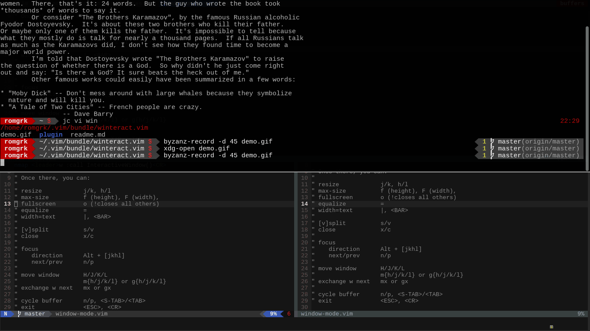

# Winteract.vim

An interactive-window mode, where you can resize windows by
repeatedly pressing j/k and h/l, amongst other things.

Other actions:
split/vsplit, close, move, change focus, 
fullscreen, fullwidth, fullheight, 
set width to textwidth, exchange position
change buffer, delete buffer



## Mappings

Add this to your vimrc/mappings!

```viml
nmap gw        :InteractiveWindow<CR>
" or
nmap <leader>w :InteractiveWindow<CR>
" or anything else
```

This calls interactive-window-mode
Once there, you can: 

```
  - resize            j/k/h/l
  - fullwidth         f
  - fullheight        F
  - fullscreen        o (!closes all others)
  - equalize          =
  - width=count       [count]|
  - height=count      [count]\
  - width=textwidth   &
  
  - [v]split          s/v
  - close             x/c
  
  - focus             Alt + [jkhl]            
    - next/prev       w/W
  
  - move window       H/J/K/L  
                      m{h/j/k/l} or g{h/j/k/l}
  - exchange          mx or gx
  
  - change buffer     n/p, <S-TAB>/<TAB>
  - exit mode         <ESC>, <CR>
```

Here is the complete table. (you can add stuff, it's golbal)

```viml
let winmap.normal = {
\ "h": "normal! \<C-w><" , "=": "normal! \<C-w>=" ,
\ "j": "normal! \<C-w>-" , "f": "normal! \<C-w>_" ,
\ "k": "normal! \<C-w>+" , "F": "normal! \<C-w>|" ,
\ "l": "normal! \<C-w>>" , "o": "normal! \<C-w>o" ,
\
\ "|": "exe g:winmode.count.'wincmd |'",
\ "\\": "exe g:winmode.count.'wincmd _'",
\ "&": "normal! :\<C-r>=&tw\<CR>wincmd |\<CR>" ,
\ 
\ "\<A-h>": "normal! \<C-w>h" ,  "H": "normal! \<C-w>H" ,
\ "\<A-j>": "normal! \<C-w>j" ,  "J": "normal! \<C-w>J" ,
\ "\<A-k>": "normal! \<C-w>k" ,  "K": "normal! \<C-w>K" ,
\ "\<A-l>": "normal! \<C-w>l" ,  "L": "normal! \<C-w>L" ,
\
\ "x": "normal! \<C-w>c" , "n": "normal! :bn\<CR>" ,
\ "c": "normal! \<C-w>c" , "p": "normal! :bp\<CR>" ,
\ "s": "normal! \<C-w>s" , "\<TAB>": "normal! :bn\<CR>" ,
\ "v": "normal! \<C-w>v" , "\<S-TAB>": "normal! :bp\<CR>" ,
\ 
\ "w": "normal! \<C-w>w" , "\<A-w>": "normal! \<C-w>p" ,
\ "W": "normal! \<C-w>W" ,
\ "q": "normal! :copen\<CR>" ,
\
\ "m": "let g:winmode.submode='move'" ,
\ ":": "let g:winmode.submode='set'" ,
\ "t": "let g:winmode.submode='tab'" ,
\
\ "d": "bdelete" ,
\ ";": "terminal" ,
\
\ "\<ESC>": "let exitwin=1" ,
\ "\<CR>": "let exitwin=1" ,
\}

let winmap.move = {
\ "h": "normal! \<C-w>H" ,
\ "j": "normal! \<C-w>J" ,
\ "k": "normal! \<C-w>K" ,
\ "l": "normal! \<C-w>L" ,
\ "x": "normal! \<C-w>x" ,
\ "r": "normal! \<C-w>r" ,
\ "\<ESC>": "\" NOP" ,
\ }

let winmap.set = {
\ "w": "exe g:winmode.count.'wincmd |'",
\ "h": "exe g:winmode.count.'wincmd _'",
\ "W": "wincmd |",
\ "H": "wincmd _",
\ "\<ESC>": "let resetmode=1" ,
\ }

let winmap.tab = {
\ "o": "tab sview %" ,
\ "e": "tabnew" ,
\ "x": "tabclose" ,
\ "n": "tabnext" ,
\ "p": "tabprevious" ,
\
\ "w": "let g:winmode.submode='normal'" ,
\ "\<ESC>": "let exitwin=1" ,
\ }
```
